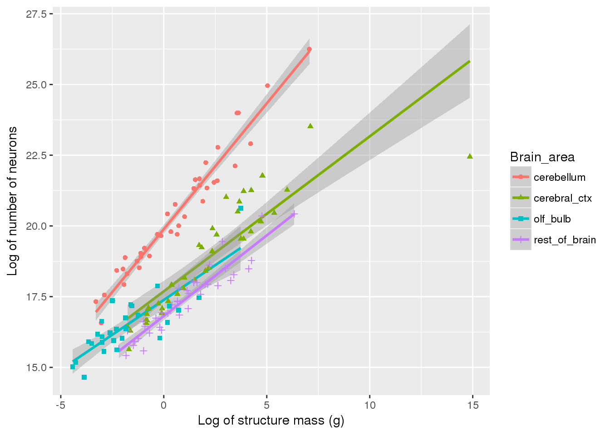

```{r setup, include=FALSE}
knitr::opts_chunk$set(echo = TRUE)
library(ggplot2)
library(magrittr)
library(gdata)
library(ggrepel)
library(dplyr)
library(LearnBayes)
library("ggmap", lib.loc = "/storage/work/csm5410/sw/r_packages")
library("ggplot2", lib.loc = "/storage/work/csm5410/sw/r_packages")
```

<center><h1> Project 1 </h1>
<br>
<br>
<h2> Summary </h2>
<br>
<br>
<h3> Background </h3>
The first project was mainly about using data from "Mammalian Brains Are Made of These..." (Herculano-Houzel, S., Catania, K., Manger, P. R., & Kaas, J. H.; 2015) paper to replicate the results. The replication of the results consisted of creating some graphs that were already presented in the paper. Later, we created new graphs from the data point to help explain the results of the paper, as well as to find out additional results that the researcher might have missed while interpreting the data.
<br>

<h3> Procedure </h3>
The link for the data was provided with the paper itself, and it was extremely easy to download the raw datafile. The datafile was in excel sheet format with different excel sheets dedicated to different areas of the brain. We used 'rstudio' software* provided by The Pennsylvania State University to manipulate the data. The tasks performed for the 'cleaning' process of the data was as follows:
</center>
<br>

1. Import the CSV from `../data/csv/<brain-area>.csv`.
2. Delete the second row since it contains comments we do not need.
3. Rename the variables to be shorter and more transparent.
4. Add a variable called `Brain_area` equal to `<brain-area>`.
5. Clean data fields with +/- char.

<font size="1.5"> *Note: All the codes used for this project are openly shared on [GitHub](https://github.com/gilmore-lab/brain-behavior-data). </font>

<center>
<br>
<h3> Results </h3>
<br>


<h3> Conclusions </h3>

<h3> Discussion </h3>


