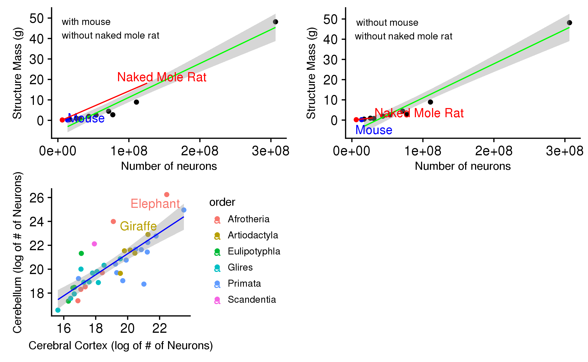

```{r setup, include=FALSE}
knitr::opts_chunk$set(echo = TRUE)
library(ggplot2)
library(magrittr)
library(gdata)
library(ggrepel)
library(dplyr)
library(LearnBayes)
library("ggmap", lib.loc = "/storage/work/csm5410/sw/r_packages")
library("ggplot2", lib.loc = "/storage/work/csm5410/sw/r_packages")
```

<center><h1> Project 1 </h1>
<br>
<br>
<h2> Summary </h2>
<br>
<br>
<h3> Background </h3>
The first project was mainly about using data from "Mammalian Brains Are Made of These..." (Herculano-Houzel, S., Catania, K., Manger, P. R., & Kaas, J. H.; 2015) paper to replicate the results. The replication of the results consisted of creating some graphs that were already presented in the paper. Later, we created new graphs from the data point to help explain the results of the paper, as well as to find out additional results that the researcher might have missed while interpreting the data.
<br>

<h3> Procedure </h3>
The link for the data was provided with the paper itself, and it was extremely easy to download the raw datafile. The datafile was in excel sheet format with different excel sheets dedicated to different areas of the brain. We used 'rstudio' software* provided by The Pennsylvania State University to manipulate the data. The tasks performed for the 'cleaning' process of the data was as follows:
</center>
<br>

1. Import the CSV from `../data/csv/<brain-area>.csv`.
2. Delete the second row since it contains comments we do not need.
3. Rename the variables to be shorter and more transparent.
4. Add a variable called `Brain_area` equal to `<brain-area>`.
5. Clean data fields with +/- char.

<font size="1.5"> *Note: All the codes used for this project are openly shared on [GitHub](https://github.com/gilmore-lab/brain-behavior-data). </font>

<center>
<br>
<h3> Results </h3>
<br> </center>
<center> { width=60% } </center>
<br>
This figure shows that cerebellum has higher number of neurons for that structure's mass as compared to other brain areas. Additionally, the confidence interval for cerebellum is much shorter than other brain areas. Outliers of individual brain areas are recorded below.
<center>
{ width=70% } </center>
<br>
(A) This graph shows just the graph for cerebellum where you can see that Homosapiens (Human beings) and Loxodontaafricana (African Elephants) are outliers having more number of neurons according to their structure mass as compared to other species. (B)For cerebral cortex, only the African Elephant is an outlier. But the interesting thing about this finding is that African Elephants have lower number of neurons according to their structure mass as compared to other species. (C)Tragelaphus strepsiceros is a Greater Kudu (type of a woodland antelope) and it seems to have less number of neurons than average based on its structural mass of olfactory bulb. It would be interesting to know about its smelling abilities as compared to that of the African Bush elephants, because they seem to have higher number of neurons compared to its brain mass. The second animal is Heterocephalus Glaber, aka Naked Mole Rat. It also has less number of neurons as compared to its structure mass of olfactory bulb. Does that seem to have a difference between the smelling abilities? (D) In this data plot, again we find similar outliers as we found in the 'Cerebellum Data Plot.' Hence, we can maybe try to divide the rest of the brain in temporal lobe and other different brain areas to see exactly which part of those brain areas have more number of neurons and we can create an experiment to test those results by seeing if they really have some kind of a difference. If they do have difference, then we can say that these connections and the number of neurons are actually very important for higher processing, but if not then we cannot really support the hypothesis that higher number of neurons correlates to better processing.
<br>
<br>

<center> { width=75% } </center>
<br>
This figure shows three of the plots that were recreated from the Herculano-Houtzel paper. It shows the reproducibility of the data and its figures.

<center>  </center>

<br>
<br>

<center>
<h3> Conclusions </h3>
<br>


<h3> Discussion </h3>

</center>


