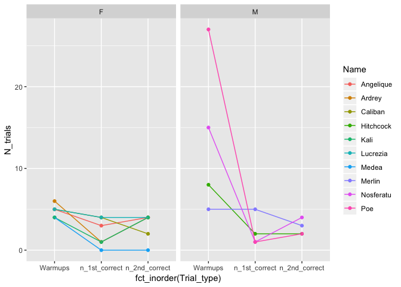

clean-evolution-of-self--control-data
================
Charmi
11/1/2017

Purpose
-------

This file imports the data from

MacLean, Evan L., et al (2014). The evolution of self-control. PNAS, 111(20), E2140-E2148. Retrieved from <http://dx.doi.org/10.1073/pnas.1323533111> and <https://figshare.com/articles/MacLean_et_al_PNAS_2014_Self-Control_Data/5579335>

and tidies it up, creating a single data file.

The data have already been gathered and saved as separate CSVs by different sheets we made in excel in ../data/csv.

Import CSVs and create merged data file
---------------------------------------

Here are the steps we want to do for tidying and combing two separate CSV files:

1.  Import the CSV from `../data/csv/cog_task_avg_score.csv`
2.  Include the cylinder task data and A.not.B.Task data in one column, and arrange by common name.
3.  Clean out the '-' from subj\_info file.
4.  Import the CSV from `../data/csv/subj_info.csv`
5.  Make a new column for task responses as 'Y' if '\*' and 'N' if '-'.
6.  Remove the old columns with '\*' and '-' as input.
7.  Merge cog\_task\_avg\_score and subj\_info together by Common.Name.

``` r
cog <- read_csv("../data/csv/cog_task_avg_score.csv")
```

    ## Parsed with column specification:
    ## cols(
    ##   Common.Name = col_character(),
    ##   Latin.Name = col_character(),
    ##   Cylinder.Task = col_character(),
    ##   A.not.B.Task = col_character(),
    ##   Composite.Score = col_character()
    ## )

``` r
cog<-cog %>%
       gather(Task, Score, Cylinder.Task: A.not.B.Task) %>% arrange(Common.Name)

#Cleaning out '-' from Score

cog$Score <- gsub('-',NA,cog$Score,fixed=TRUE)
cog$Score <- as.factor(cog$Score)

#Cleaning out '-' from Composite Score

cog$Composite.Score <- gsub('-',NA,cog$Composite.Score,fixed=TRUE)
cog$Composite.Score <- as.factor(cog$Composite.Score)
cog
```

    ## # A tibble: 72 x 5
    ##    Common.Name    Latin.Name              Composite.Score Task       Score
    ##    <chr>          <chr>                   <fct>           <chr>      <fct>
    ##  1 Asian elephant Elephas maximus         <NA>            Cylinder.… <NA> 
    ##  2 Asian elephant Elephas maximus         <NA>            A.not.B.T… 0    
    ##  3 aye aye        Daubentonia madagascar… <NA>            Cylinder.… 51   
    ##  4 aye aye        Daubentonia madagascar… <NA>            A.not.B.T… <NA> 
    ##  5 black lemur    Eulemur macaco          55.5            Cylinder.… 51   
    ##  6 black lemur    Eulemur macaco          55.5            A.not.B.T… 60   
    ##  7 bonobo         Pan paniscus            97.5            Cylinder.… 95   
    ##  8 bonobo         Pan paniscus            97.5            A.not.B.T… 100  
    ##  9 brown lemur    Eulemur fulvus          <NA>            Cylinder.… 43.3 
    ## 10 brown lemur    Eulemur fulvus          <NA>            A.not.B.T… <NA> 
    ## # ... with 62 more rows

``` r
sub_info <- read_csv("../data/csv/subj_info.csv")
```

    ## Parsed with column specification:
    ## cols(
    ##   Species = col_character(),
    ##   Population = col_character(),
    ##   Subject = col_character(),
    ##   Sex = col_character(),
    ##   Age = col_character(),
    ##   Cylinder = col_character(),
    ##   A.not.B = col_character()
    ## )

``` r
names(sub_info)[1] <- "Common.Name"

A.not.B.Y <- sub_info$A.not.B == "*"
Cylinder.Y <- sub_info$Cylinder == "*"
sub_info$A.not.B.Y.N[A.not.B.Y] <- "Y"
```

    ## Warning: Unknown or uninitialised column: 'A.not.B.Y.N'.

``` r
sub_info$A.not.B.Y.N[!A.not.B.Y] <- "N"
sub_info$Cylinder.Y.N[Cylinder.Y] <- "Y"
```

    ## Warning: Unknown or uninitialised column: 'Cylinder.Y.N'.

``` r
sub_info$Cylinder.Y.N[!Cylinder.Y] <- "N"
sub_info <- sub_info %>% select(-A.not.B, -Cylinder)

sub_info
```

    ## # A tibble: 567 x 7
    ##    Common.Name  Population    Subject Sex   Age   A.not.B.Y.N Cylinder.Y.N
    ##    <chr>        <chr>         <chr>   <chr> <chr> <chr>       <chr>       
    ##  1 Asian eleph… Golden Trian… Am      F     3     Y           N           
    ##  2 Asian eleph… Golden Trian… Bo      F     33    Y           N           
    ##  3 Asian eleph… Golden Trian… NamFon  F     10    Y           N           
    ##  4 Asian eleph… Golden Trian… Pepsi   M     10    Y           N           
    ##  5 Asian eleph… Golden Trian… Ploy    F     16    Y           N           
    ##  6 Asian eleph… Golden Trian… Puki    M     40    Y           N           
    ##  7 Asian eleph… Golden Trian… TangMo  F     4     Y           N           
    ##  8 aye aye      Duke Lemur C… Angeli… F     5     N           Y           
    ##  9 aye aye      Duke Lemur C… Ardrey  F     14    N           Y           
    ## 10 aye aye      Duke Lemur C… Caliban F     16    N           Y           
    ## # ... with 557 more rows

``` r
merged <- left_join(cog, sub_info, by="Common.Name")
merged
```

    ## # A tibble: 1,072 x 11
    ##    Common.Name Latin.Name Composite.Score Task  Score Population Subject
    ##    <chr>       <chr>      <fct>           <chr> <fct> <chr>      <chr>  
    ##  1 Asian elep… Elephas m… <NA>            Cyli… <NA>  Golden Tr… Am     
    ##  2 Asian elep… Elephas m… <NA>            Cyli… <NA>  Golden Tr… Bo     
    ##  3 Asian elep… Elephas m… <NA>            Cyli… <NA>  Golden Tr… NamFon 
    ##  4 Asian elep… Elephas m… <NA>            Cyli… <NA>  Golden Tr… Pepsi  
    ##  5 Asian elep… Elephas m… <NA>            Cyli… <NA>  Golden Tr… Ploy   
    ##  6 Asian elep… Elephas m… <NA>            Cyli… <NA>  Golden Tr… Puki   
    ##  7 Asian elep… Elephas m… <NA>            Cyli… <NA>  Golden Tr… TangMo 
    ##  8 Asian elep… Elephas m… <NA>            A.no… 0     Golden Tr… Am     
    ##  9 Asian elep… Elephas m… <NA>            A.no… 0     Golden Tr… Bo     
    ## 10 Asian elep… Elephas m… <NA>            A.no… 0     Golden Tr… NamFon 
    ## # ... with 1,062 more rows, and 4 more variables: Sex <chr>, Age <chr>,
    ## #   A.not.B.Y.N <chr>, Cylinder.Y.N <chr>

``` r
col_order <- c("Common.Name", "Latin.Name", "A.not.B.Y.N", "Cylinder.Y.N", "Task", "Score", "Composite.Score", "Sex", "Age", "Population", "Subject")
merged_new <- merged[,col_order]
merged_new
```

    ## # A tibble: 1,072 x 11
    ##    Common.Name Latin.Name A.not.B.Y.N Cylinder.Y.N Task  Score
    ##    <chr>       <chr>      <chr>       <chr>        <chr> <fct>
    ##  1 Asian elep… Elephas m… Y           N            Cyli… <NA> 
    ##  2 Asian elep… Elephas m… Y           N            Cyli… <NA> 
    ##  3 Asian elep… Elephas m… Y           N            Cyli… <NA> 
    ##  4 Asian elep… Elephas m… Y           N            Cyli… <NA> 
    ##  5 Asian elep… Elephas m… Y           N            Cyli… <NA> 
    ##  6 Asian elep… Elephas m… Y           N            Cyli… <NA> 
    ##  7 Asian elep… Elephas m… Y           N            Cyli… <NA> 
    ##  8 Asian elep… Elephas m… Y           N            A.no… 0    
    ##  9 Asian elep… Elephas m… Y           N            A.no… 0    
    ## 10 Asian elep… Elephas m… Y           N            A.no… 0    
    ## # ... with 1,062 more rows, and 5 more variables: Composite.Score <fct>,
    ## #   Sex <chr>, Age <chr>, Population <chr>, Subject <chr>

Clean Cylinder and A-not-B CSV files
------------------------------------

1.  Import both the csv files
2.  Change column names to make it shorter and more specific
3.  Merge both data files to make one file altogether

``` r
cyl_task <- read_csv("../data/csv/Cylinder.csv")
```

    ## Parsed with column specification:
    ## cols(
    ##   Species = col_character(),
    ##   Population = col_character(),
    ##   Sex = col_character(),
    ##   `Subject #` = col_integer(),
    ##   Warmups = col_integer(),
    ##   `Test % Correct` = col_double(),
    ##   `1st Half % Correct` = col_integer(),
    ##   `2nd Half % Correct` = col_integer()
    ## )

``` r
ab_task <- read_csv("../data/csv/A-not-B.csv")
```

    ## Parsed with column specification:
    ## cols(
    ##   Species = col_character(),
    ##   Population = col_character(),
    ##   Sex = col_character(),
    ##   `Sub #` = col_integer(),
    ##   `Trials to criterion` = col_integer(),
    ##   `Test Accuracy` = col_integer()
    ## )

``` r
colnames(cyl_task) <- c("Species", "Pop", "Sex", "Sub_no.", "Warmups", "Test_percent_correct", "first_corr", "second_corr")
colnames(ab_task) <- c("Species", "Pop", "Sex", "Sub_no.", "Trials", "Accuracy")
```

Now we will change the species names to make both dataframe equal

``` r
cyl_task$Species <- sub("black lemur", "Black Lemur", cyl_task$Species)
ab_task$Species <- sub("Capuchin monkey", "Capuchin", ab_task$Species)
ab_task$Species <- sub("Fox Squirrel", "Fox squirrel", ab_task$Species)
cyl_task$Species <- sub("Golden Monkey", "Golden monkey", cyl_task$Species)
ab_task$Species <- sub("Mongolian Gerbil", "Mongolian gerbil", ab_task$Species)
cyl_task$Species <- sub("ruffed lemur", "Ruffed lemur", cyl_task$Species)
ab_task$Species <- sub("White Carnea Pigeon", "White Carneau Pigeon", ab_task$Species)
ab_task$Species <- sub("Canis latrans", "Coyote", ab_task$Species)
ab_task$Species <- sub("Elphas maximus", "Asian Elephant", ab_task$Species)

cyl_task <- cyl_task %>% arrange(Species, Sub_no.)
ab_task <- ab_task %>% arrange(Species, Sub_no.)

ab_task
```

    ## # A tibble: 345 x 6
    ##    Species      Pop                          Sex   Sub_no. Trials Accuracy
    ##    <chr>        <chr>                        <chr>   <int>  <int>    <int>
    ##  1 Asian Eleph… Golden Triangle Asian Eleph… M           1     12        0
    ##  2 Asian Eleph… Golden Triangle Asian Eleph… F           2     12        0
    ##  3 Asian Eleph… Golden Triangle Asian Eleph… F           3      3        0
    ##  4 Asian Eleph… Golden Triangle Asian Eleph… M           4     12        0
    ##  5 Asian Eleph… Golden Triangle Asian Eleph… F           5      9        0
    ##  6 Asian Eleph… Golden Triangle Asian Eleph… F           6      9        0
    ##  7 Asian Eleph… Golden Triangle Asian Eleph… F           7      9        0
    ##  8 Black lemur  Duke Lemur Center            M           1      6        1
    ##  9 Black lemur  Duke Lemur Center            F           2      3        1
    ## 10 Black lemur  Duke Lemur Center            M           3      3        1
    ## # ... with 335 more rows

``` r
cyl_task
```

    ## # A tibble: 439 x 8
    ##    Species Pop   Sex   Sub_no. Warmups Test_percent_co… first_corr
    ##    <chr>   <chr> <chr>   <int>   <int>            <dbl>      <int>
    ##  1 Aye Aye Duke… M           1       5               80        100
    ##  2 Aye Aye Duke… F           2       5               60         80
    ##  3 Aye Aye Duke… F           3       5               70         60
    ##  4 Aye Aye Duke… F           4       5               80         80
    ##  5 Aye Aye Duke… M           5       8               40         40
    ##  6 Aye Aye Duke… F           6       4                0          0
    ##  7 Aye Aye Duke… F           7       6               50         20
    ##  8 Aye Aye Duke… F           8       4               50         20
    ##  9 Aye Aye Duke… M           9      15               50         20
    ## 10 Aye Aye Duke… M          10      27               30         20
    ## # ... with 429 more rows, and 1 more variable: second_corr <int>

Let's write this to a new, clean directory (../data/cleaned)

``` r
write_csv(merged_new, path = "../data/cleaned/cog_score_and_sub_info.csv")
```

Update: Clean and merge the new dataset provided by Dr. Evan MacLean
--------------------------------------------------------------------

``` r
indv_cyl <- read_csv("../data/csv/indiv_dat_cyl.csv")
```

    ## Parsed with column specification:
    ## cols(
    ##   Species = col_character(),
    ##   Population = col_character(),
    ##   Name = col_character(),
    ##   Sex = col_character(),
    ##   Age = col_character(),
    ##   `Subject #` = col_integer(),
    ##   Warmups = col_integer(),
    ##   `Test % Correct` = col_double(),
    ##   `1st Half % Correct` = col_integer(),
    ##   `2nd Half % Correct` = col_integer()
    ## )

``` r
indv_AB <- read_csv("../data/csv/indiv_dat_AB.csv")
```

    ## Parsed with column specification:
    ## cols(
    ##   Species = col_character(),
    ##   Population = col_character(),
    ##   Subject = col_character(),
    ##   Sex = col_character(),
    ##   Age = col_character(),
    ##   `Sub #` = col_integer(),
    ##   `Trials to criterion` = col_integer(),
    ##   `Test Accuracy` = col_integer()
    ## )

``` r
indv_cyl$n_1st_correct <- (indv_cyl$`1st Half % Correct`/100*5)
indv_cyl$n_2nd_correct <- (indv_cyl$`2nd Half % Correct`/100*5)

indv_cyl <- gather(indv_cyl, key=Trial_type, value = N_trials, Warmups, `n_1st_correct`, `n_2nd_correct`)

indv_cyl
```

    ## # A tibble: 1,317 x 11
    ##    Species Population Name  Sex   Age   `Subject #` `Test % Correct`
    ##    <chr>   <chr>      <chr> <chr> <chr>       <int>            <dbl>
    ##  1 Aye Aye Duke Lemu… Merl… M     15.7…           1               80
    ##  2 Aye Aye Duke Lemu… Cali… F     15.5…           2               60
    ##  3 Aye Aye Duke Lemu… Ange… F     4.68…           3               70
    ##  4 Aye Aye Duke Lemu… Lucr… F     8.72…           4               80
    ##  5 Aye Aye Duke Lemu… Hitc… M     5.22…           5               40
    ##  6 Aye Aye Duke Lemu… Medea F     5.68…           6                0
    ##  7 Aye Aye Duke Lemu… Ardr… F     13.9…           7               50
    ##  8 Aye Aye Duke Lemu… Kali  F     12.2…           8               50
    ##  9 Aye Aye Duke Lemu… Nosf… M     25.1…           9               50
    ## 10 Aye Aye Duke Lemu… Poe   M     24.1…          10               30
    ## # ... with 1,307 more rows, and 4 more variables: `1st Half %
    ## #   Correct` <int>, `2nd Half % Correct` <int>, Trial_type <chr>,
    ## #   N_trials <dbl>

``` r
## Remove the redundant columns (1st Half, 2nd Half %, Test % correct)

indv_cyl$Species <- sub("black lemur", "Black Lemur", indv_cyl$Species)
indv_cyl$Species <- sub("Brown lemur", "Brown Lemur", indv_cyl$Species)
indv_cyl$Species <- sub("ruffed lemur", "Ruffed Lemur", indv_cyl$Species)
indv_AB$Species <- sub("Black lemur", "Black Lemur", indv_AB$Species)

write_csv(indv_cyl, path = "../data/cleaned/cyl_indv.csv")
write_csv(indv_AB, path = "../data/cleaned/ab_indv.csv")

# write_csv(ab_task, path="../data/cleaned/ab_task.csv")
# write_csv(cyl_task, path="../data/cleaned/cyl_task.csv")
# 
# indv_cyl
```

``` r
# p1 <- ggplot(data = indv_cyl) + aes(x = Trial_type, y = N_trials, color = Species, group_by(Species)) + geom_point() + geom_line()
# p1

indv_cyl %>% filter(Species == 'Aye Aye') %>% ggplot() +
  aes(x = Trial_type, y = N_trials, color = Name) +
  geom_point() +
  geom_line(aes(group = Name)) +
  facet_grid(cols = vars(Sex)) +
  aes(x= fct_inorder(Trial_type))
```


