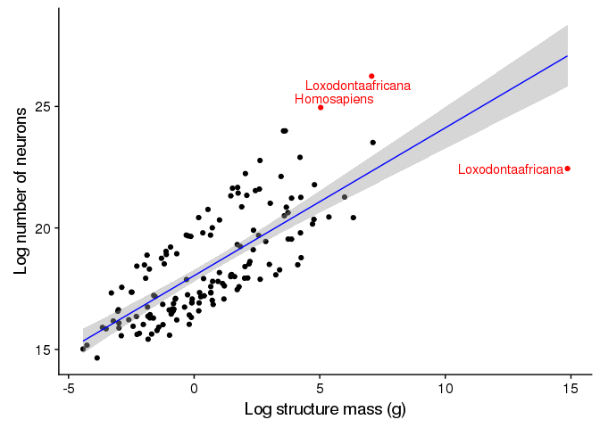
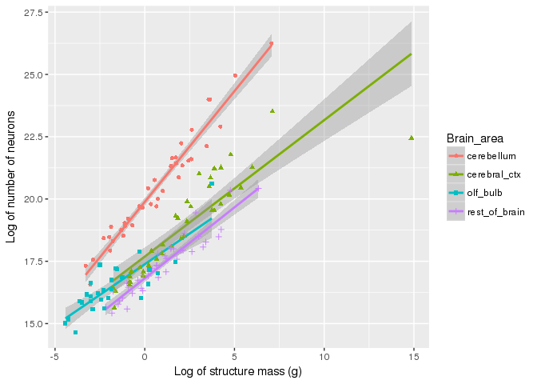

brain-size-neuron-plot
================
Charmi
10/5/2017

<center>
<h1>
Goals
</h1>
<br> <i>Load data and separate into different brain areas</i>
</center>
``` r
#load data

hh <- read.csv("../data/cleaned/herculano-houtzel-all.csv")

#Separating different brain areas

cerebellum_dat <- hh[which(hh$Brain_area == 'cerebellum'),]
cerebral_ctx_dat <- hh[which(hh$Brain_area == 'cerebral_ctx'), ]
olf_bulb_dat <- hh[which(hh$Brain_area == 'olf_bulb'), ]
whole_brain_dat <- hh[which(hh$Brain_area == 'whole_brain'), ]
rest_of_brain_dat <- hh[which(hh$Brain_area == 'rest_of_brain'), ]
```

<center>
<h2>
Plots
</h2>
</center>
<br> <br>
<center>
<i> Equation of the regression line for plot of 'Brain mass by number of neurons' </i>
</center>
<center>
<h3>
Plot of Brain mass by Number of Neurons
</h3>
</center>


<center>
<i> equation of the regression line plotted above is: </i>
</center>
    ## [1] "                              y = 0.6*x + 18"

Loxodontaafricana are also known as African Bush Elephants that can weigh upto ten tonnes and grow upto 4 meters height! Homo sapiens (aka Humans) also have greater number of neurons compared to their brain mass, but only in one dimension. Below is a graph pointing out the brain mass versus number of neurons for all different brain areas for these two species.

<center>
<h3>
Labelling all Homosapiens in the Graph
</h3>
</center>


<center>
<h3>
Neurons/mg for cerebellum v/s cerebral cortex
</h3>
<h5>
with highlighted outliers
</h5>
<i> Gorillagorilla data was not present in cerebral cortex, so it was skipped for this graph </i>
</center>


<center>
Sciurus Carolinensis are Eastern Gray Squirrels, and they have more neurons in their cerebellum as compared to their cerebral cortex. Let's see where on the graphs do Homo Sapiens lie compared to the Sciurus Carolinensis.
</center>
<br> <br>

<center>
<h5>
with labelled 'Homo Sapiens', 'Loxodontaafricanas', and 'Sciuruscarolinensis'
</h5>
</center>


<center>
From the above graph, we can see that Loxodonta Africanas have lower number of neurons/mg in their cerebral cortex as well as their cerebellum. Homo Sapiens seem to have a lower than average amount of neurons/mg in their cerebellum as well as cerebral cortex. Compared to them, Scirius carolinesis have an extremely high amounts of neurons/mg in their cerebellum compared to their cerebral cortex.
</center>
<br> <br>

``` r
# Plot with diff shape, color for brain areas
# Worked on in lab meeting 2017-10-19
hh %>%
  select(Species, Mass_g, N_neurons, Brain_area) %>%
  group_by(Species) %>% 
  mutate(Whole_brain_g = sum(Mass_g), Whole_brain_n = sum(N_neurons)) %>%
  ggplot() +
  aes(x=log(Mass_g), y=log(N_neurons), shape=Brain_area, color=Brain_area) +
  geom_smooth(method = "lm") +
  geom_point()
```


