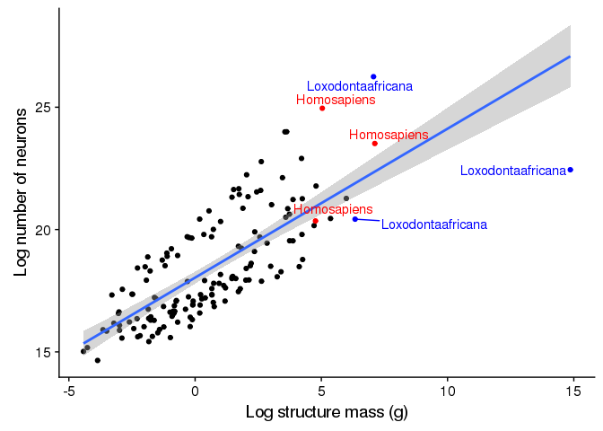

brain-size-neuron-plot
================
Charmi
10/5/2017

<center>
<h1>
Goals
</h1>
<br> <i>Load data and separate into different brain areas</i>
</center>
``` r
#load data

hh <- read.csv("../data/cleaned/herculano-houtzel-all.csv")

#Separating different brain areas

cerebellum_dat <- hh[which(hh$Brain_area == 'cerebellum'),]
cerebral_ctx_dat <- hh[which(hh$Brain_area == 'cerebral_ctx'), ]
olf_bulb_dat <- hh[which(hh$Brain_area == 'olf_bulb'), ]
whole_brain_dat <- hh[which(hh$Brain_area == 'whole_brain'), ]
rest_of_brain_dat <- hh[which(hh$Brain_area == 'rest_of_brain'), ]

cerebellum_dat
```

    ##                       Species        Order   Mass_g Mass_SD    N_neurons
    ## 1       Amblysomushottentotus   Afrotheria    0.084      NA     34488379
    ## 4       Antidorcasmarsupialis Artiodactyla   11.458      NA   2257214074
    ## 7            Aotustrivirgatus      Primata    1.732   0.218   1040000000
    ## 10          Blarinabrevicauda Eulipotyphla    0.037   0.005     33430000
    ## 13          Callithrixjacchus      Primata    0.730   0.039    361370000
    ## 16             Caviaporcellus       Glires    0.500   0.077    167854925
    ## 19                Cebusapella      Primata    4.600      NA   2490000000
    ## 22          Condyluracristata Eulipotyphla    0.138   0.012    105920000
    ## 25                 Cynomyssp.       Glires    0.789   0.093    350084813
    ## 28  Damaliscusdorcasphillipsi Artiodactyla   13.402      NA   2401712670
    ## 31      Dasyproctaprimnolopha       Glires    2.742      NA    673488085
    ## 34        Dendrohyraxdorsalis   Afrotheria    1.918      NA    360929350
    ## 37         Elephantulusmyurus   Afrotheria    0.168      NA     89312372
    ## 40   Giraffacamelopardalensis Artiodactyla   67.730      NA   8878076563
    ## 43             Gorillagorilla      Primata   37.560      NA  26400000000
    ## 44       Heterocephalusglaber       Glires    0.048   0.004     15742270
    ## 48                Homosapiens      Primata  154.020  19.290  69030000000
    ## 50   Hydrochoerushydrochaeris       Glires    6.632   1.312   1157810000
    ## 54          Loxodontaafricana   Afrotheria 1171.628      NA 250708527536
    ## 57         Macacafascicularis      Primata    5.642      NA   2572600000
    ## 59              Macacamulatta      Primata    7.694      NA   4550000000
    ## 62              Macacaradiata      Primata    5.748      NA   2038554160
    ## 65        Mesocricetusauratus       Glires    0.145   0.030     61210000
    ## 68          Microcebusmurinus      Primata    0.391      NA    221386140
    ## 71                Musmusculus       Glires    0.056   0.005     42219708
    ## 74       Oryctolaguscuniculus       Glires    1.412      NA    396671250
    ## 77           Otolemurgarnetti      Primata    1.196   0.105    743500000
    ## 80    Papioanubiscynocephalus      Primata   13.745      NA   7794907300
    ## 83         Parascalopsbreweri Eulipotyphla    0.102   0.005    100780000
    ## 86   Petrodromustetradactylus   Afrotheria    0.304      NA    110653150
    ## 89              Pongopygmaeus      Primata   35.060   4.340  26300000000
    ## 90           Procaviacapensis   Afrotheria    2.058      NA    488373000
    ## 93      Proechimyscayennensis       Glires    0.330   0.026    162512050
    ## 96           Rattusnorvegicus       Glires    0.272   0.038    139171882
    ## 99            Saimirisciureus      Primata    4.300      NA   1820000000
    ## 102         Scalopusaquaticus Eulipotyphla    0.153   0.008    158550000
    ## 105       Sciuruscarolinensis       Glires    0.874   0.069    342832180
    ## 108       Susscrofadomesticus Artiodactyla    8.128      NA   1858320313
    ## 111     Tragelaphusstripceros Artiodactyla   31.776      NA   4042494141
    ## 114                Tupaiaglis   Scandentia    0.326   0.018    185280000
    ##      N_neurons_SD     N_other N_other_SD Neurons_per_mg Neurons_per_mg_SD
    ## 1       3,207,000     8155621    813,000         409687            18,667
    ## 4            <NA>   467244676       <NA>         196999              <NA>
    ## 7      20,000,000   145270000 45,030,000         605080            90,570
    ## 10      5,821,000     4410000  1,280,000         919942            19,721
    ## 13     28,530,000    49490000  6,770,000         494970            25,740
    ## 16      2,175,973    36290075  4,506,186         339755            48,069
    ## 19           <NA>   245810000       <NA>         540310              <NA>
    ## 22     22,100,000    19480000  6,420,000         776460           181,530
    ## 25     72,177,851    66155187 39,268,821         440658            39,554
    ## 28           <NA>   443918456       <NA>         179206              <NA>
    ## 31     48,145,960   155986915 32,978,520         253208            39,447
    ## 34           <NA>    77570650       <NA>         188180              <NA>
    ## 37      2,852,000    23368628  1,279,000         531494            10,651
    ## 40           <NA>  5520360938       <NA>         131080              <NA>
    ## 43           <NA>  2900000000       <NA>         702875              <NA>
    ## 44      2,849,254     5482730  1,274,352         327280            48,331
    ## 48  6,650,000,000 16040000000  2,170,000         471660            90,393
    ## 50      5,515,433   570940000 81,105,148         177982            34,889
    ## 54           <NA> 38507229964       <NA>         213983              <NA>
    ## 57           <NA>   135400000       <NA>         455973              <NA>
    ## 59           <NA>   931030000       <NA>         590800              <NA>
    ## 62           <NA>   453565840       <NA>         354655              <NA>
    ## 65     12,351,246     7430000  1,713,108         424002             3,743
    ## 68           <NA>    17433860       <NA>         566205              <NA>
    ## 71      9,277,647     6947791  1,502,773         746691           128,541
    ## 74           <NA>   124578750       <NA>         280929              <NA>
    ## 77     52,450,000    65960000 20,290,000         623080            45,720
    ## 80           <NA>   525977700       <NA>         567109              <NA>
    ## 83     13,850,000     7010000  1,100,000         997370           173,030
    ## 86     14,948,000    34657851 15,801,000         362537            15,780
    ## 89  2,470,000,000  2200000000       <NA>         750143              <NA>
    ## 90     42,322,000    91005000 30,180,000         242415            46,950
    ## 93      3,553,848    36372950  5,094,068         494338            28,466
    ## 96     11,185,675    29005617  6,282,204         522688           108,847
    ## 99           <NA>   133020000       <NA>         424000              <NA>
    ## 102    13,630,000    17510000  3,160,000        1037390            63,570
    ## 105    71,181,798   110797820  9,070,639         392363            74,294
    ## 108          <NA>   348710938       <NA>         228632              <NA>
    ## 111          <NA>  1266099609       <NA>         127218              <NA>
    ## 114    16,980,000    19980000  1,510,000         571460            83,200
    ##     Other_per_mg Other_per_mg_SD Other_per_neuron Other_per_neuron_SD
    ## 1          96849           5,069            0.236               0.002
    ## 4          40779            <NA>            0.207                  NA
    ## 7          82890          15,580            0.140                  NA
    ## 10        118736          25,620            0.132                  NA
    ## 13         68170          12,210            0.137                  NA
    ## 16         72824           2,216            0.216               0.024
    ## 19         53440            <NA>            0.099                  NA
    ## 22        139912          39,720            0.184               0.004
    ## 25         84802          54,286            0.192               0.123
    ## 28         33123            <NA>            0.184                  NA
    ## 31         57945           7,405            0.234               0.066
    ## 34         40444            <NA>            0.215                  NA
    ## 37        139028           5,956            0.261               0.005
    ## 40         81505            <NA>            0.622                  NA
    ## 43         77210            <NA>            0.110                  NA
    ## 44        115748          32,952            0.356               0.106
    ## 48        101020          19,800            0.232               0.019
    ## 50         86574           4,902            0.493               0.068
    ## 54         32866            <NA>            0.154                  NA
    ## 57         23999            <NA>            0.053                  NA
    ## 59        121010            <NA>            0.205                  NA
    ## 62         78908            <NA>            0.222                  NA
    ## 65         51332           1,054            0.121                  NA
    ## 68         44588            <NA>            0.079                  NA
    ## 71        123493          25,715            0.165               0.017
    ## 74         88229            <NA>            1.222                  NA
    ## 77         54460          11,890            0.089                  NA
    ## 80         38267            <NA>            0.067                  NA
    ## 83         68795           7,910            0.070                  NA
    ## 86        110153          41,831            0.299               0.102
    ## 89         62750            <NA>            0.084                  NA
    ## 90         46365          19,711            0.182               0.046
    ## 93        110122           6,716            0.224               0.026
    ## 96        108555          29,355            0.209               0.047
    ## 99         30940            <NA>            0.073                  NA
    ## 102       114660          20,790            0.110                  NA
    ## 105       127682          19,212            0.336               0.090
    ## 108        42902            <NA>            0.188                  NA
    ## 111        39845            <NA>            0.313                  NA
    ## 114        61600           7,990            0.108                  NA
    ##                           Source Brain_area
    ## 1                Nevesetal.,2014 cerebellum
    ## 4                 Kazuetal.,2014 cerebellum
    ## 7     Herculano-Houzeletal.,2007 cerebellum
    ## 10               Sarkoetal.,2009 cerebellum
    ## 13    Herculano-Houzeletal.,2007 cerebellum
    ## 16    Herculano-Houzeletal.,2006 cerebellum
    ## 19    Herculano-Houzeletal.,2007 cerebellum
    ## 22               Sarkoetal.,2009 cerebellum
    ## 25    Herculano-Houzeletal.,2011 cerebellum
    ## 28                Kazuetal.,2014 cerebellum
    ## 31    Herculano-Houzeletal.,2006 cerebellum
    ## 34               Nevesetal.,2014 cerebellum
    ## 37               Nevesetal.,2014 cerebellum
    ## 40                Kazuetal.,2014 cerebellum
    ## 43  Herculano-HouzelandKaas,2011 cerebellum
    ## 44    Herculano-Houzeletal.,2011 cerebellum
    ## 48             Azevedoetal.,2009 cerebellum
    ## 50    Herculano-Houzeletal.,2006 cerebellum
    ## 54    Herculano-Houzeletal.,2014 cerebellum
    ## 57                Gabietal.,2010 cerebellum
    ## 59    Herculano-Houzeletal.,2007 cerebellum
    ## 62                Gabietal.,2010 cerebellum
    ## 65    Herculano-Houzeletal.,2006 cerebellum
    ## 68                Gabietal.,2010 cerebellum
    ## 71    Herculano-Houzeletal.,2006 cerebellum
    ## 74    Herculano-Houzeletal.,2011 cerebellum
    ## 77    Herculano-Houzeletal.,2007 cerebellum
    ## 80                Gabietal.,2010 cerebellum
    ## 83               Sarkoetal.,2009 cerebellum
    ## 86               Nevesetal.,2014 cerebellum
    ## 89  Herculano-HouzelandKaas,2011 cerebellum
    ## 90               Nevesetal.,2014 cerebellum
    ## 93    Herculano-Houzeletal.,2011 cerebellum
    ## 96    Herculano-Houzeletal.,2006 cerebellum
    ## 99    Herculano-Houzeletal.,2007 cerebellum
    ## 102              Sarkoetal.,2009 cerebellum
    ## 105   Herculano-Houzeletal.,2011 cerebellum
    ## 108               Kazuetal.,2014 cerebellum
    ## 111               Kazuetal.,2014 cerebellum
    ## 114   Herculano-Houzeletal.,2007 cerebellum

``` r
cerebral_ctx_dat
```

    ##                       Species        Order      Mass_g Mass_SD   N_neurons
    ## 3       Amblysomushottentotus   Afrotheria       0.439   0.035    21516000
    ## 6       Antidorcasmarsupialis Artiodactyla      68.806      NA   396896159
    ## 9            Aotustrivirgatus      Primata      10.617   0.610   441900000
    ## 12          Blarinabrevicauda Eulipotyphla       0.197   0.012    11876000
    ## 15          Callithrixjacchus      Primata       5.561   0.443   244720000
    ## 18             Caviaporcellus       Glires       1.938   0.231    43510525
    ## 21                Cebusapella      Primata      39.178      NA  1140000000
    ## 24          Condyluracristata Eulipotyphla       0.420   0.024    17250000
    ## 27                 Cynomyssp.       Glires       2.586   0.109    53768353
    ## 30  Damaliscusdorcasphillipsi Artiodactyla     111.310      NA   570673431
    ## 33      Dasyproctaprimnolopha       Glires       8.913   1.214   110641950
    ## 36        Dendrohyraxdorsalis   Afrotheria       7.560      NA    98960000
    ## 39         Elephantulusmyurus   Afrotheria       0.471   0.021    25865000
    ## 42   Giraffacamelopardalensis Artiodactyla     398.808      NA  1730513460
    ## 46       Heterocephalusglaber       Glires       0.184   0.026     6151875
    ## 49                Homosapiens      Primata    1232.930 233.680 16340000000
    ## 52   Hydrochoerushydrochaeris       Glires      48.175   2.714   306501565
    ## 55          Loxodontaafricana   Afrotheria 2847594.000      NA  5593241033
    ## 58         Macacafascicularis      Primata      36.226      NA   800955000
    ## 61              Macacamulatta      Primata      69.832      NA  1710000000
    ## 64              Macacaradiata      Primata      48.274      NA  1655707140
    ## 67        Mesocricetusauratus       Glires       0.446   0.048    17140000
    ## 70          Microcebusmurinus      Primata       0.908      NA    22310400
    ## 73                Musmusculus       Glires       0.173   0.015    13688162
    ## 76       Oryctolaguscuniculus       Glires       4.448      NA    71448750
    ## 79           Otolemurgarnetti      Primata       6.290   0.863   226090000
    ## 82    Papioanubiscynocephalus      Primata     120.214      NA  2875028372
    ## 85         Parascalopsbreweri Eulipotyphla       0.429   0.019    15690000
    ## 88   Petrodromustetradactylus   Afrotheria       1.239   0.059    33947000
    ## 92           Procaviacapensis   Afrotheria      10.478   0.646   197933000
    ## 95      Proechimyscayennensis       Glires       0.924   0.050    26086024
    ## 98           Rattusnorvegicus       Glires       0.769   0.113    31017192
    ## 101           Saimirisciureus      Primata      20.652   0.368  1340000000
    ## 104         Scalopusaquaticus Eulipotyphla       0.476   0.032    26680000
    ## 107       Sciuruscarolinensis       Glires       2.730   0.178    77334617
    ## 110       Susscrofadomesticus Artiodactyla      42.202      NA   307082404
    ## 113     Tragelaphusstripceros Artiodactyla     213.370      NA   762567178
    ## 116                Tupaiaglis   Scandentia       1.455   0.174    60390000
    ## 118          Callimicogoeldii      Primata      12.984      NA   357129180
    ##      N_neurons_SD     N_other    N_other_SD Neurons_per_mg
    ## 3       2,154,000    21370000     4,614,000          48932
    ## 6            <NA>  4126259275          <NA>           5768
    ## 9     111,310,000   695420000   130,000,000          41990
    ## 12      1,569,000    15820000     1,158,000          60214
    ## 15     81,180,000   395340000    58,790,000          44280
    ## 18      3,169,924   108614475    12,775,334          22508
    ## 21           <NA>  2550000000          <NA>          29180
    ## 24      3,105,000    32010000     8,822,000          40777
    ## 27      6,044,322   183451647    17,959,104          20866
    ## 30           <NA>  6762256227          <NA>           5127
    ## 33      2,576,768   416208050       950.422          13250
    ## 36           <NA>   183540000          <NA>          13098
    ## 39      4,020,000    26229000     1,104,000          54644
    ## 42           <NA> 27513706540          <NA>           4339
    ## 46      1,065,587     8398125     1,197,056          33374
    ## 49  2,170,000,000 60840000000 7,020,000,000          13520
    ## 52     62,726,120  1847818435   512,392,109           6336
    ## 55           <NA> 55698998687          <NA>           1964
    ## 58           <NA>  2758845000          <NA>          22110
    ## 61           <NA>  5270000000          <NA>          24470
    ## 64           <NA>  3808672860          <NA>          34298
    ## 67      3,619,934    41870000     1,350,121          39099
    ## 70           <NA>    70649600          <NA>          24571
    ## 73      2,242,257    12061838     3,668,594          78672
    ## 76           <NA>   254801250          <NA>          16063
    ## 79     87,570,000   402070000    74,790,000          37820
    ## 82           <NA>  7569751628          <NA>          23916
    ## 85      2,611,000    39870000     4,884,000          36727
    ## 88      5,840,000    40486000     1,104,000          27236
    ## 92     29,082,000   366620000    13,520,000          19134
    ## 95      2,155,723    71833039     6,712,722          28321
    ## 98        3034654    45687808     5,678,958          41092
    ## 101    20,000,000  1610000000    40,000,000          64930
    ## 104     5,113,000    38540000     5,567,000          60461
    ## 107     2,634,444   209654717    13,003,170          28384
    ## 110          <NA>  3250251354          <NA>           7276
    ## 113          <NA> 12302304448          <NA>           3574
    ## 116    26,510,000    85580000     8,400,000          42900
    ## 118          <NA>   715330820          <NA>          27505
    ##     Neurons_per_mg_SD Other_per_mg Other_per_mg_SD Other_per_neuron
    ## 3               1,004        48146           6,674            0.982
    ## 6                <NA>        59969            <NA>           10.396
    ## 9              12,900        65330           5,950            1.574
    ## 12              4,935        80729           8,731            1.357
    ## 15             15,900        71800          14,880            1.615
    ## 18              1,050        56036              93            2.492
    ## 21               <NA>        64980            <NA>            2.237
    ## 24              5,145        76995          25,019            1.966
    ## 27              3,113        71202           9,677            3.432
    ## 30               <NA>        60760            <NA>           11.851
    ## 33              1,633        49939           7,422            3.763
    ## 36               <NA>        24291            <NA>            1.855
    ## 39              6,098        55693             138            1.032
    ## 42               <NA>        68990            <NA>           15.900
    ## 46              2,063        45894          11,497            1.365
    ## 49              3,636        49230           3,755            3.723
    ## 52                945        38117           8,489            5.983
    ## 55               <NA>        52721            <NA>           26.844
    ## 58               <NA>        76156            <NA>            3.444
    ## 61               <NA>        75400            <NA>            3.082
    ## 64               <NA>        78897            <NA>            2.300
    ## 67             12,332        94271           7,136            2.507
    ## 70               <NA>        77808            <NA>            3.167
    ## 73              7,683        68643          15,807            0.870
    ## 76               <NA>        57284            <NA>            3.566
    ## 79             20,500        63610           3,400            1.778
    ## 82               <NA>        62969            <NA>            2.633
    ## 85              7,359        93185          14,583            2.581
    ## 88              3,416        32550           2,661            1.202
    ## 92              3,955        35203           3,461            1.883
    ## 95              3,870        78011          11,497            2.752
    ## 98              7,999        60426          12,477            1.497
    ## 101             7,420        77840             790            1.201
    ## 104            12,249        80745           6,407            1.383
    ## 107             1,487        76877           3,859            2.709
    ## 110              <NA>        77016            <NA>           10.585
    ## 113              <NA>        57657            <NA>           16.133
    ## 116            23,350        58900           1,270            1.417
    ## 118              <NA>        55093            <NA>            2.003
    ##     Other_per_neuron_SD                     Source   Brain_area
    ## 3                 0.116            Nevesetal.,2014 cerebral_ctx
    ## 6                    NA             Kazuetal.,2014 cerebral_ctx
    ## 9                    NA Herculano-Houzeletal.,2007 cerebral_ctx
    ## 12                0.250            Sarkoetal.,2009 cerebral_ctx
    ## 15                   NA Herculano-Houzeletal.,2007 cerebral_ctx
    ## 18                0.112 Herculano-Houzeletal.,2006 cerebral_ctx
    ## 21                   NA Herculano-Houzeletal.,2007 cerebral_ctx
    ## 24                0.924            Sarkoetal.,2009 cerebral_ctx
    ## 27                0.433 Herculano-Houzeletal.,2011 cerebral_ctx
    ## 30                   NA             Kazuetal.,2014 cerebral_ctx
    ## 33                0.096 Herculano-Houzeletal.,2006 cerebral_ctx
    ## 36                   NA            Nevesetal.,2014 cerebral_ctx
    ## 39                0.119            Nevesetal.,2014 cerebral_ctx
    ## 42                   NA             Kazuetal.,2014 cerebral_ctx
    ## 46                0.125 Herculano-Houzeletal.,2011 cerebral_ctx
    ## 49                0.675          Azevedoetal.,2009 cerebral_ctx
    ## 52                0.447 Herculano-Houzeletal.,2006 cerebral_ctx
    ## 55                   NA Herculano-Houzeletal.,2014 cerebral_ctx
    ## 58                   NA             Gabietal.,2010 cerebral_ctx
    ## 61                   NA Herculano-Houzeletal.,2007 cerebral_ctx
    ## 64                   NA             Gabietal.,2010 cerebral_ctx
    ## 67                0.608 Herculano-Houzeletal.,2006 cerebral_ctx
    ## 70                   NA             Gabietal.,2010 cerebral_ctx
    ## 73                0.177 Herculano-Houzeletal.,2006 cerebral_ctx
    ## 76                   NA Herculano-Houzeletal.,2011 cerebral_ctx
    ## 79                   NA Herculano-Houzeletal.,2007 cerebral_ctx
    ## 82                   NA             Gabietal.,2010 cerebral_ctx
    ## 85                0.109            Sarkoetal.,2009 cerebral_ctx
    ## 88                0.053            Nevesetal.,2014 cerebral_ctx
    ## 92                0.208            Nevesetal.,2014 cerebral_ctx
    ## 95                0.030 Herculano-Houzeletal.,2011 cerebral_ctx
    ## 98                0.328 Herculano-Houzeletal.,2006 cerebral_ctx
    ## 101                  NA Herculano-Houzeletal.,2007 cerebral_ctx
    ## 104               0.368            Sarkoetal.,2009 cerebral_ctx
    ## 107               0.076 Herculano-Houzeletal.,2011 cerebral_ctx
    ## 110                  NA             Kazuetal.,2014 cerebral_ctx
    ## 113                  NA             Kazuetal.,2014 cerebral_ctx
    ## 116                  NA Herculano-Houzeletal.,2007 cerebral_ctx
    ## 118                  NA             Gabietal.,2010 cerebral_ctx

``` r
olf_bulb_dat
```

    ##                          Species        Order Mass_g Mass_SD N_neurons
    ## 119    Antidorcasmarsupialis,n=1 Artiodactyla  1.200      NA  15998400
    ## 120         Aotustrivirgatus,n=6      Primata  0.050   0.012   7925468
    ## 121        Blarinabrevicauda,n=5 Eulipotyphla  0.026   0.003   8090000
    ## 122           Caviaporcellus,n=2       Glires  0.103   0.013   6065700
    ## 123        Condyluracristata,n=4 Eulipotyphla  0.040   0.005  10550000
    ## 124    Dasyproctaprimnolopha,n=3       Glires  0.737   0.162  58124085
    ## 125       Elephantulusmyurus,n=2   Afrotheria  0.050   0.010   9693534
    ## 126 Giraffacamelopardalensis,n=1 Artiodactyla  2.052      NA  24678000
    ## 127     Heterocephalusglaber,n=3       Glires  0.021   0.001   2303030
    ## 128 Hydrochoerushydrochaeris,n=2       Glires  1.302   0.031  28560310
    ## 129        Loxodontaafricana,n=1   Afrotheria 41.886      NA 908371986
    ## 130            Macacamulatta,n=1      Primata  0.088      NA   8473800
    ## 131      Mesocricetusauratus,n=2       Glires  0.055   0.011   5747930
    ## 132        Microcebusmurinus,n=2      Primata  0.030   0.008   7636912
    ## 133              Musmusculus,n=4       Glires  0.014   0.004   3893300
    ## 134     Oryctolaguscuniculus,n=1       Glires  0.156      NA  18765000
    ## 135        Otolemurgarnetti,n=11      Primata  0.200   0.016  30237060
    ## 136       Parascalopsbreweri,n=3 Eulipotyphla  0.049   0.008  16750000
    ## 137 Petrodromustetradactylus,n=2   Afrotheria  0.159   0.009  12828365
    ## 138         Procaviacapensis,n=1   Afrotheria  0.286      NA  20909490
    ## 139    Proechimyscayennensis,n=1       Glires  0.132      NA   9141540
    ## 140         Rattusnorvegicus,n=5       Glires  0.074   0.022  11103272
    ## 141        Scalopusaquaticus,n=3 Eulipotyphla  0.082   0.005  34610000
    ## 142      Sciuruscarolinensis,n=9       Glires  0.212   0.022  28845724
    ## 143              Sorexfumeus,n=3 Eulipotyphla  0.012   0.002   3330000
    ## 144      Susscrofadomesticus,n=1 Artiodactyla  0.822      NA   9195500
    ## 145    Tragelaphusstripceros,n=1 Artiodactyla  5.546      NA  38331562
    ## 146              Tupaiaglis,n=16   Scandentia  0.100   0.032  12700000
    ##     N_neurons_SD    N_other N_other_SD Neurons_per_mg Neurons_per_mg_SD
    ## 119         <NA>  105201600       <NA>          13332              <NA>
    ## 120    3,114,924    8360532  3,213,106         155879            62,241
    ## 121      935,900    4910000    730,000         318164            34,950
    ## 122    1,295,335   10154300  4,220,098          58560             5,340
    ## 123    4,290,000    7470000    970,000         254720            74,620
    ## 124    4,952,795   72595915 19,682,805          88008            14,973
    ## 125    1,745,000    4919466       <NA>         194678             5,708
    ## 126         <NA>  232384500       <NA>          12026              <NA>
    ## 127      636,099    3571970  1,548,861         108895            22,957
    ## 128    8,515,588   67389690 21,015,416          21864             6,018
    ## 129         <NA> 2857878014       <NA>          21687              <NA>
    ## 130         <NA>   11006200       <NA>          96293              <NA>
    ## 131      347,203    5507170  2,277,605         105418            27,498
    ## 132      119,088    9723088    842,576         270894            61,946
    ## 133    1,246,396    5456700  1,154,502         257475            34,036
    ## 134         <NA>   22935000       <NA>         120288              <NA>
    ## 135    9,645,480   34244000  7,155,556         149219            47,590
    ## 136    6,370,000   10910000  3,400,000         333590            81,590
    ## 137      380,000   14775635       <NA>          80805             3,084
    ## 138         <NA>   14790510       <NA>          73110              <NA>
    ## 139         <NA>   21128460       <NA>          69254              <NA>
    ## 140    3,202,766    9238728  2,250,728         152373            26,913
    ## 141    5,960,000   17780000  2,060,000         423520            94,950
    ## 142    7,903,412   39015942 12,812,316         137532            38,236
    ## 143    1,050,000    2760000    130,000         289806           124,350
    ## 144         <NA>   77554500       <NA>          11187              <NA>
    ## 145         <NA>  362731438       <NA>           6912              <NA>
    ## 146    3,584,952   20068000  6,541,838         130173            17,451
    ##     Other_per_mg Other_per_mg_SD Other_per_neuron Other_per_neuron_SD
    ## 119        87668            <NA>            6.576                  NA
    ## 120       162922          44,209            1.055                  NA
    ## 121       193631          31,450            0.607               0.125
    ## 122        96793          29,011            1.637               0.346
    ## 123       185124          19,370            0.708               0.328
    ## 124       107301           1,958            1.239               0.233
    ## 125        97872            <NA>            0.507                  NA
    ## 126       113248            <NA>            9.417                  NA
    ## 127       167991          62,442            1.516               0.254
    ## 128        51544          17,981            2.333               0.180
    ## 129        68230            <NA>            3.146                  NA
    ## 130       125070            <NA>            1.299                  NA
    ## 131        96197          21,237            0.972               0.455
    ## 132       341900          54,311            1.273                  NA
    ## 133       371204          75,573            1.454               0.260
    ## 134       147019            <NA>            1.222                  NA
    ## 135       170505          39,463            1.133                  NA
    ## 136       217440          41,370            0.651               0.168
    ## 137        91369            <NA>            1.141                  NA
    ## 138        51715            <NA>            0.707                  NA
    ## 139       160064            <NA>            2.311                  NA
    ## 140       126210           8,033            0.848               0.145
    ## 141       215230          14,600            0.514               0.154
    ## 142       185359          58,050            1.478               0.776
    ## 143       235249          44,620            0.829             214.000
    ## 144        94348            <NA>            8.434                  NA
    ## 145        58913            <NA>            8.523                  NA
    ## 146       205876          51,596            1.580                  NA
    ##                         Source Brain_area
    ## 119             Kazuetal.,2014   olf_bulb
    ## 120          Ribeiroetal.,2014   olf_bulb
    ## 121            Sarkoetal.,2009   olf_bulb
    ## 122 Herculano-Houzeletal.,2006   olf_bulb
    ## 123            Sarkoetal.,2009   olf_bulb
    ## 124 Herculano-Houzeletal.,2006   olf_bulb
    ## 125            Nevesetal.,2014   olf_bulb
    ## 126             Kazuetal.,2014   olf_bulb
    ## 127 Herculano-Houzeletal.,2011   olf_bulb
    ## 128 Herculano-Houzeletal.,2006   olf_bulb
    ## 129 Herculano-Houzeletal.,2014   olf_bulb
    ## 130          Ribeiroetal.,2014   olf_bulb
    ## 131 Herculano-Houzeletal.,2006   olf_bulb
    ## 132          Ribeiroetal.,2014   olf_bulb
    ## 133 Herculano-Houzeletal.,2006   olf_bulb
    ## 134 Herculano-Houzeletal.,2011   olf_bulb
    ## 135          Ribeiroetal.,2014   olf_bulb
    ## 136            Sarkoetal.,2009   olf_bulb
    ## 137            Nevesetal.,2014   olf_bulb
    ## 138            Nevesetal.,2014   olf_bulb
    ## 139 Herculano-Houzeletal.,2011   olf_bulb
    ## 140 Herculano-Houzeletal.,2006   olf_bulb
    ## 141            Sarkoetal.,2009   olf_bulb
    ## 142 Herculano-Houzeletal.,2011   olf_bulb
    ## 143            Sarkoetal.,2009   olf_bulb
    ## 144             Kazuetal.,2014   olf_bulb
    ## 145             Kazuetal.,2014   olf_bulb
    ## 146 Herculano-Houzeletal.,2007   olf_bulb

``` r
whole_brain_dat
```

    ##  [1] Species             Order               Mass_g             
    ##  [4] Mass_SD             N_neurons           N_neurons_SD       
    ##  [7] N_other             N_other_SD          Neurons_per_mg     
    ## [10] Neurons_per_mg_SD   Other_per_mg        Other_per_mg_SD    
    ## [13] Other_per_neuron    Other_per_neuron_SD Source             
    ## [16] Brain_area         
    ## <0 rows> (or 0-length row.names)

``` r
rest_of_brain_dat
```

    ##                       Species        Order  Mass_g Mass_SD N_neurons
    ## 2       Amblysomushottentotus   Afrotheria   0.289   0.013   9070358
    ## 5       Antidorcasmarsupialis Artiodactyla  25.810      NA  70485000
    ## 8            Aotustrivirgatus      Primata   3.104      NA  49340000
    ## 11          Blarinabrevicauda Eulipotyphla   0.113   0.009   6340000
    ## 14          Callithrixjacchus      Primata   1.489   0.317  29720000
    ## 17             Caviaporcellus       Glires   1.218   0.178  22191825
    ## 20                Cebusapella      Primata   8.430      NA  61850000
    ## 23          Condyluracristata Eulipotyphla   0.244   0.026   8160000
    ## 26                 Cynomyssp.       Glires   1.945   0.146  34090600
    ## 29  Damaliscusdorcasphillipsi Artiodactyla  30.006      NA  86428126
    ## 32      Dasyproctaprimnolopha       Glires   5.972   0.514  43204320
    ## 35        Dendrohyraxdorsalis   Afrotheria   3.328      NA  44671471
    ## 38         Elephantulusmyurus   Afrotheria   0.401   0.063  14012533
    ## 41   Giraffacamelopardalensis Artiodactyla  70.680      NA 142697625
    ## 45       Heterocephalusglaber       Glires   0.160   0.019   4981317
    ## 47                Homosapiens      Primata 117.660  45.420 690000000
    ## 51   Hydrochoerushydrochaeris       Glires  19.927   0.270 108250000
    ## 53          Loxodontaafricana   Afrotheria 564.674      NA 741704844
    ## 56         Macacafascicularis      Primata   4.294      NA  65449620
    ## 60              Macacamulatta      Primata   9.204   0.871 121900000
    ## 63              Macacaradiata      Primata   7.448      NA  61359000
    ## 66        Mesocricetusauratus       Glires   0.375   0.057   5870000
    ## 69          Microcebusmurinus      Primata   0.500      NA  11014640
    ## 72                Musmusculus       Glires   0.172   0.019  11960000
    ## 75       Oryctolaguscuniculus       Glires   3.272      NA  26085000
    ## 78           Otolemurgarnetti      Primata   2.131   0.021  20800000
    ## 81    Papioanubiscynocephalus      Primata  17.235      NA 278150760
    ## 84         Parascalopsbreweri Eulipotyphla   0.228   0.009   7130000
    ## 87   Petrodromustetradactylus   Afrotheria   0.894   0.022  12231811
    ## 91           Procaviacapensis   Afrotheria   4.317   0.625  69358240
    ## 94      Proechimyscayennensis       Glires   0.824   0.006  13492039
    ## 97           Rattusnorvegicus       Glires   0.683   0.153  18678758
    ## 100           Saimirisciureus      Primata   5.004      NA  65530000
    ## 103         Scalopusaquaticus Eulipotyphla   0.370   0.042  16560000
    ## 106       Sciuruscarolinensis       Glires   1.943   0.156  33493401
    ## 109       Susscrofadomesticus Artiodactyla  13.850      NA  58709836
    ## 112     Tragelaphusstripceros Artiodactyla  61.716      NA 106590230
    ## 115                Tupaiaglis   Scandentia   0.919   0.072  22480000
    ## 117          Callimicogoeldii      Primata   2.086      NA  53911480
    ##     N_neurons_SD     N_other    N_other_SD Neurons_per_mg
    ## 2      1,069,000    16834642     3,276,000          31616
    ## 5           <NA>  1319280624          <NA>           2731
    ## 8           <NA>   313460000          <NA>          15900
    ## 11       636,200    13320000     1,120,000          55924
    ## 14     9,350,000   145910000    27,830,000          19650
    ## 17     9,431,638    83183175     8,139,966          18990
    ## 20          <NA>   506110000          <NA>           7340
    ## 23     2,180,000    31550000     5,950,000          33475
    ## 26       589,361   167742733     5,025,290          17590
    ## 29          <NA>  2136071876          <NA>           2880
    ## 32          <NA>   356835680          <NA>           6830
    ## 35          <NA>   152466529          <NA>          13423
    ## 38     3,258,000    28997467     7,906,000          34520
    ## 41          <NA>  4878864876          <NA>           2019
    ## 45       853,026    10310350     1,843,572          31674
    ## 47   120,000,000  7730000000 1,450,000,000           6560
    ## 51     4,400,000   779170000   381,900,000           5434
    ## 53          <NA> 27404306156          <NA>           1314
    ## 56          <NA>   260170380          <NA>          15242
    ## 60          <NA>   966520000          <NA>          12410
    ## 63          <NA>   616641000          <NA>           8238
    ## 66     1,162,059    21330000     8,878,857          15611
    ## 69          <NA>    50865360          <NA>          22029
    ## 72     1,577,022    14850000     3,590,591          64301
    ## 75          <NA>   251415000          <NA>           7972
    ## 78    12,280,000   147440000    64,500,000           9730
    ## 81          <NA>  1079809236          <NA>          16136
    ## 84       920,000    31380000     1,500,000          31276
    ## 87       188,000    28204189     5,408,000          13696
    ## 91       762,000   162984760     6,105,000          16436
    ## 94     1,533,120    73068898     2,691,449          16381
    ## 97     4,243,909    47221243     5,979,982          27813
    ## 100         <NA>   302590000          <NA>          13090
    ## 103    2,990,000    45690000     4,820,000          44620
    ## 106   17,128,790   210023933     3,415,060          17616
    ## 109         <NA>  1096821414          <NA>           4238
    ## 112         <NA>  3408779523          <NA>           1727
    ## 115         <NA>    87080000          <NA>          25900
    ## 117         <NA>   194528520          <NA>          25844
    ##     Neurons_per_mg_SD Other_per_mg Other_per_mg_SD Other_per_neuron
    ## 2               5,124        58880          13,983            1.839
    ## 5                <NA>        51115            <NA>           18.710
    ## 8                <NA>       100990            <NA>            6.353
    ## 11              2,130       117736           5,840            2.102
    ## 14              2,840        98370            <NA>            4.909
    ## 17             10,522        69528          16,855            4.035
    ## 20               <NA>        60040            <NA>            8.183
    ## 23              8,560       128990          17,820            3.866
    ## 26              1,335        86542           6,793            4.923
    ## 29               <NA>        71188            <NA>           24.718
    ## 32               <NA>        56408            <NA>               NA
    ## 35               <NA>        45813            <NA>            3.413
    ## 38              2,702        70967           8,566            2.048
    ## 41               <NA>        69028            <NA>           34.190
    ## 45              8,484        64145           3,790            2.125
    ## 47              2,115        69850          20,026           11.203
    ## 51               <NA>        39234            <NA>               NA
    ## 53               <NA>        48531            <NA>           36.948
    ## 56               <NA>        60589            <NA>            3.975
    ## 60               <NA>        98420            <NA>            7.929
    ## 63               <NA>        82793            <NA>           10.050
    ## 66                715        55804          15,174            3.556
    ## 69               <NA>       101731            <NA>            4.618
    ## 72              6,623        79839          11,249            1.242
    ## 75               <NA>        76838            <NA>               NA
    ## 78              5,920        69040            <NA>            7.088
    ## 81               <NA>        62656            <NA>            3.882
    ## 84              3,180       137960           7,180            4.401
    ## 87                547        31716           6,830            2.300
    ## 91              2,556        38353           4,138            2.351
    ## 94              1,973        88667           2,658            5.462
    ## 97              6,171        71760          18,475            2.587
    ## 100              <NA>        60470            <NA>            4.618
    ## 103             4,900       123600           2,550            2.759
    ## 106             9,989       108482           7,808            7.246
    ## 109              <NA>        79192            <NA>           18.682
    ## 112              <NA>        55233            <NA>           31.980
    ## 115              <NA>       100320            <NA>            3.874
    ## 117              <NA>        93254            <NA>            3.608
    ##     Other_per_neuron_SD                     Source    Brain_area
    ## 2                 0.144            Nevesetal.,2014 rest_of_brain
    ## 5                    NA             Kazuetal.,2014 rest_of_brain
    ## 8                    NA Herculano-Houzeletal.,2007 rest_of_brain
    ## 11                0.096            Sarkoetal.,2009 rest_of_brain
    ## 14                   NA Herculano-Houzeletal.,2007 rest_of_brain
    ## 17                   NA Herculano-Houzeletal.,2006 rest_of_brain
    ## 20                   NA Herculano-Houzeletal.,2007 rest_of_brain
    ## 23                1.692            Sarkoetal.,2009 rest_of_brain
    ## 26                   NA Herculano-Houzeletal.,2011 rest_of_brain
    ## 29                   NA             Kazuetal.,2014 rest_of_brain
    ## 32                   NA Herculano-Houzeletal.,2006 rest_of_brain
    ## 35                   NA            Nevesetal.,2014 rest_of_brain
    ## 38                0.088            Nevesetal.,2014 rest_of_brain
    ## 41                   NA             Kazuetal.,2014 rest_of_brain
    ## 45                   NA Herculano-Houzeletal.,2011 rest_of_brain
    ## 47                2.352          Azevedoetal.,2009 rest_of_brain
    ## 51                   NA Herculano-Houzeletal.,2006 rest_of_brain
    ## 53                   NA Herculano-Houzeletal.,2014 rest_of_brain
    ## 56                   NA             Gabietal.,2010 rest_of_brain
    ## 60                   NA Herculano-Houzeletal.,2007 rest_of_brain
    ## 63                   NA             Gabietal.,2010 rest_of_brain
    ## 66                   NA Herculano-Houzeletal.,2006 rest_of_brain
    ## 69                   NA             Gabietal.,2010 rest_of_brain
    ## 72                   NA Herculano-Houzeletal.,2006 rest_of_brain
    ## 75                   NA Herculano-Houzeletal.,2011 rest_of_brain
    ## 78                   NA Herculano-Houzeletal.,2007 rest_of_brain
    ## 81                   NA             Gabietal.,2010 rest_of_brain
    ## 84                0.375            Sarkoetal.,2009 rest_of_brain
    ## 87                0.407            Nevesetal.,2014 rest_of_brain
    ## 91                0.114            Nevesetal.,2014 rest_of_brain
    ## 94                   NA Herculano-Houzeletal.,2011 rest_of_brain
    ## 97                   NA Herculano-Houzeletal.,2006 rest_of_brain
    ## 100                  NA Herculano-Houzeletal.,2007 rest_of_brain
    ## 103               0.379            Sarkoetal.,2009 rest_of_brain
    ## 106                  NA Herculano-Houzeletal.,2011 rest_of_brain
    ## 109                  NA             Kazuetal.,2014 rest_of_brain
    ## 112                  NA             Kazuetal.,2014 rest_of_brain
    ## 115                  NA Herculano-Houzeletal.,2007 rest_of_brain
    ## 117                  NA             Gabietal.,2010 rest_of_brain

<center>
<h2>
Plots
</h2>
</center>
<br> <br>
<center>
<i> Equation of the regression line for plot of 'Brain mass by number of neurons' </i>
</center>
<center>
<h3>
Plot of Brain mass by Number of Neurons
</h3>
</center>


<center>
<i> equation of the regression line plotted above is: </i>
</center>
    ## [1] "                              y = 0.6*x + 18"

Loxodontaafricana are also known as African Bush Elephants that can weigh upto ten tonnes and grow upto 4 meters height! Homo sapiens (aka Humans) also have greater number of neurons compared to their brain mass, but only in one dimension. Below is a graph pointing out the brain mass versus number of neurons for all different brain areas for these two species.

<center>
<h3>
Labelling all Homosapiens in the Graph
</h3>
</center>


<br>
<center>
<h3>
Showing different brain areas and its linear regression line with confidence intervals
</h3>
</center>
<br>


<center>
<h3>
Showing the graph of each brain area separately with its individual outliers
</h3>
<br>
<h4>
Cerebellum Data Plot
</h4>
</center>
<br>
<center>
This plot shows that Homo Sapiens and Loxodonta Africana (aka African Bush Elephants) are the only outliers, both having more number of neurons as compared to the structural mass of Cerebellum. Maybe from this data we can try to find out if both of them have similar balancing ability, co-ordination, and other functions performed by the cerebellum.
</center>
<br> <br>

<center>
<h4>
Cerebral Cortex Data Plot
</h4>
</center>
<br>
<center>
In this data plot, we can see that Homo Sapiens are not the outliers, and the most interesting thing about this plot is that Loxodonta Africana (African Bush Elephants) seem to have LESS NUMBER OF NEURONS in cerebral cortex compared to its brain's mass. So, this essentially states that humans are not as smart as they think they are, and they do not have more than average number of neurons. Finally, we can try to find out the difference in intelligence by giving certain tasks to Elephants and Humans, and see who scores better.
</center>
<br> <br>
<center>
<h4>
Olfactory Bulb Data Plot
</h4>
</center>
<center>
Tragelaphus strepsiceros is a Greater Kudu (type of a woodland antelope) and it seems to have less number of neurons than average based on its structural mass of olfactory bulb. It would be interesting to know about its smelling abilities as compared to that of the African Bush elephants, because they seem to have higher number of neurons compared to its brain mass. The second animal is Heterocephalus Glaber, aka Naked Mole Rat. It also has less number of neurons as compared to its structure mass of olfactory bulb. Does that seem to have a difference between the smelling abilities?

<br> <br>

<center>
<h4>
Rest of the Brain Data Plot
</h4>
</center>
<br>
<center>
In this data plot, again we find similar outliers as we found in the 'Cerebellum Data Plot.' Hence, we can maybe try to divide the rest of the brain in temporal lobe and other different brain areas to see exactly which part of those brain areas have more number of neurons and we can create an experiment to test those results by seeing if they really have some kind of a difference. If they do have difference, then we can say that these connections and the number of neurons are actually very important for higher processing, but if not then we cannot really support the hypothesis that higher number of neurons correlates to better processing.
</center>
<br>

<center>
<h3>
Neurons/mg for cerebellum v/s cerebral cortex
</h3>
<h4>
with highlighted outliers
</h4>
<i> Gorillagorilla data was not present in cerebral cortex, so it was skipped for this graph </i>
</center>


<center>
Sciurus Carolinensis are Eastern Gray Squirrels, and they have more neurons in their cerebellum as compared to their cerebral cortex. Let's see where on the graphs do Homo Sapiens lie compared to the Sciurus Carolinensis.
</center>
<br> <br>

<center>
<h4>
with labelled 'Homo Sapiens', 'Loxodontaafricanas', and 'Sciuruscarolinensis'
</h4>
</center>


<center>
From the above graph, we can see that Loxodonta Africanas have lower number of neurons/mg in their cerebral cortex as well as their cerebellum. Homo Sapiens seem to have a lower than average amount of neurons/mg in their cerebellum as well as cerebral cortex. Compared to them, Scirius carolinesis have an extremely high amounts of neurons/mg in their cerebellum compared to their cerebral cortex.
</center>
<br> <br>
<center>
<h3>
Dataplot for different order of species
</h3>
</center>


Create other cells data plot

Create data plot for different order of species
