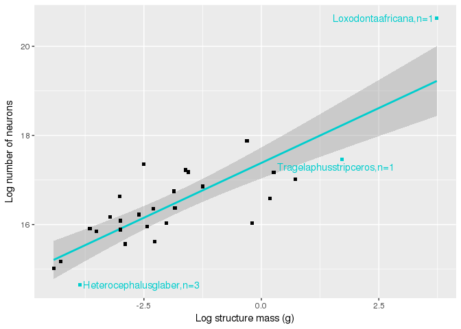
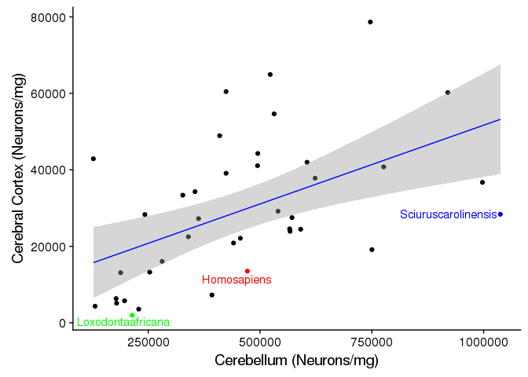

brain-size-neuron-plot
================
Charmi
10/5/2017

<center>
<h1>
Goals
</h1>
<br> <i>Load data and separate into different brain areas</i>
</center>
``` r
#load data

hh <- read.csv("../data/cleaned/herculano-houtzel-all.csv")

#Separating different brain areas

cerebellum_dat <- hh[which(hh$Brain_area == 'cerebellum'),]
cerebral_ctx_dat <- hh[which(hh$Brain_area == 'cerebral_ctx'), ]
olf_bulb_dat <- hh[which(hh$Brain_area == 'olf_bulb'), ]
whole_brain_dat <- hh[which(hh$Brain_area == 'whole_brain'), ]
rest_of_brain_dat <- hh[which(hh$Brain_area == 'rest_of_brain'), ]
```

<center>
<h2>
Plots
</h2>
</center>
<br> <br>
<center>
<i> Equation of the regression line for plot of 'Brain mass by number of neurons' </i>
</center>
<center>
<h3>
Plot of Brain mass by Number of Neurons
</h3>
</center>


<center>
<i> equation of the regression line plotted above is: </i>
</center>
    ## [1] "                              y = 0.6*x + 18"

Loxodontaafricana are also known as African Bush Elephants that can weigh upto ten tonnes and grow upto 4 meters height! Homo sapiens (aka Humans) also have greater number of neurons compared to their brain mass, but only in one dimension. Below is a graph pointing out the brain mass versus number of neurons for all different brain areas for these two species.

<center>
<h3>
Labelling all Homosapiens in the Graph
</h3>
</center>


<br>
<center>
<h3>
Showing different brain areas and its linear regression line with confidence intervals
</h3>
</center>
<br>


<center>
<h3>
Showing the graph of each brain area separately with its individual outliers
</h3>
<br>
<h4>
Cerebellum Data Plot
</h4>
</center>
 <br>
<center>
This plot shows that Homo Sapiens and Loxodonta Africana (aka African Bush Elephants) are the only outliers, both having more number of neurons as compared to the structural mass of Cerebellum. Maybe from this data we can try to find out if both of them have similar balancing ability, co-ordination, and other functions performed by the cerebellum.
</center>
<br> <br>

<center>
<h4>
Cerebral Cortex Data Plot
</h4>
</center>


<br>
<center>
In this data plot, we can see that Homo Sapiens are not the outliers, and the most interesting thing about this plot is that Loxodonta Africana (African Bush Elephants) seem to have LESS NUMBER OF NEURONS in cerebral cortex compared to its brain's mass. So, this essentially states that humans are not as smart as they think they are, and they do not have more than average number of neurons. Finally, we can try to find out the difference in intelligence by giving certain tasks to Elephants and Humans, and see who scores better.
</center>
<br> <br>
<center>
<h4>
Olfactory Bulb Data Plot
</h4>
</center>

<center>
Tragelaphus strepsiceros is a Greater Kudu (type of a woodland antelope) and it seems to have less number of neurons than average based on its structural mass of olfactory bulb. It would be interesting to know about its smelling abilities as compared to that of the African Bush elephants, because they seem to have higher number of neurons compared to its brain mass. The second animal is Heterocephalus Glaber, aka Naked Mole Rat. It also has less number of neurons as compared to its structure mass of olfactory bulb. Does that seem to have a difference between the smelling abilities?

<br> <br>

<center>
<h4>
Rest of the Brain Data Plot
</h4>
</center>


<br>
<center>
In this data plot, again we find similar outliers as we found in the 'Cerebellum Data Plot.' Hence, we can maybe try to divide the rest of the brain in temporal lobe and other different brain areas to see exactly which part of those brain areas have more number of neurons and we can create an experiment to test those results by seeing if they really have some kind of a difference. If they do have difference, then we can say that these connections and the number of neurons are actually very important for higher processing, but if not then we cannot really support the hypothesis that higher number of neurons correlates to better processing.
</center>
<br>

<center>
<h3>
Neurons/mg for cerebellum v/s cerebral cortex
</h3>
<h4>
with highlighted outliers
</h4>
<i> Gorillagorilla data was not present in cerebral cortex, so it was skipped for this graph </i>
</center>


<center>
Sciurus Carolinensis are Eastern Gray Squirrels, and they have more neurons in their cerebellum as compared to their cerebral cortex. Let's see where on the graphs do Homo Sapiens lie compared to the Sciurus Carolinensis.
</center>
<br> <br>

<center>
<h4>
with labelled 'Homo Sapiens', 'Loxodontaafricanas', and 'Sciuruscarolinensis'
</h4>
</center>


<center>
From the above graph, we can see that Loxodonta Africanas have lower number of neurons/mg in their cerebral cortex as well as their cerebellum. Homo Sapiens seem to have a lower than average amount of neurons/mg in their cerebellum as well as cerebral cortex. Compared to them, Scirius carolinesis have an extremely high amounts of neurons/mg in their cerebellum compared to their cerebral cortex.
</center>
<br> <br>
<center>
<h3>
Dataplot for different order of species
</h3>
</center>


Create other cells data plot

Create data plot for different order of species
